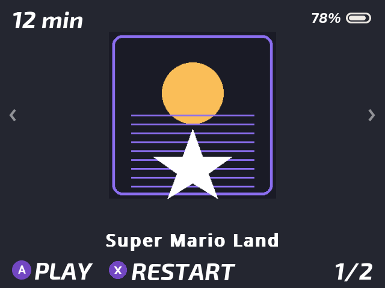
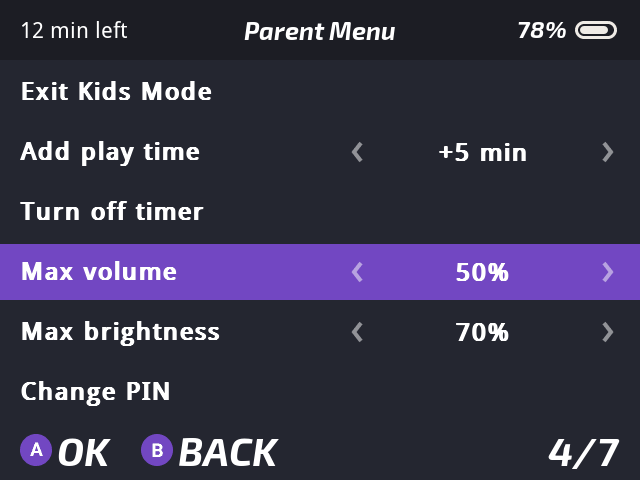
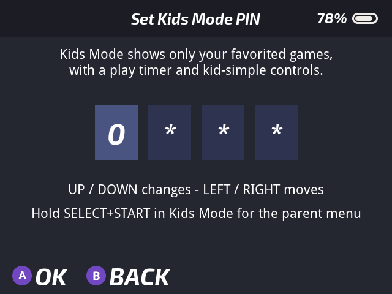

# Kids Mode for Onion OS

A fullscreen, favorites-only launcher that locks a **Miyoo Mini / Mini+**
running [Onion OS](https://github.com/OnionUI/Onion) so a young child can
use it unsupervised — big box art, one-button play, a PIN-protected exit,
and an optional play timer.

- **Boots straight into a kid-proof carousel** showing only your ★ favorited
  games: box art, big label, left/right to browse, **A** to play.
- **Native Onion look**: every screen renders through Onion's own theme
  engine — your active theme's background, fonts, colors, header/footer
  bars, button hints and full-width list rows — so Kids Mode feels like
  part of the OS, not an app drawn on top of it.
- **Exiting a game returns to the carousel — never to Onion's menus.**
- **Play timer** (per session, optional): pick 5–60 minutes when arming
  (raise the ceiling in `kidmode.json` — see [Settings](#settings)).
  Countdown shows inside games via RetroArch's on-screen messages (pinned
  during the last 5 minutes); at zero the game is asked to quit gracefully,
  so Onion's auto-save keeps the exact spot.
- **Auto power-off**: if the "Time's up!" screen is left alone for
  5 minutes (nobody turns the device off), it powers itself down cleanly
  instead of draining the battery.
- **Parent menu** (hold **SELECT+START 3 s** → PIN): exit Kids Mode, add
  play time right on the menu row — **◀ ▶** picks +5 min up to your timer
  ceiling, **A**/**START** applies, and the screen previews the remaining
  time before and after — or **turn the timer off entirely** so the kid can
  play with no limit.
- **Start over**: **X** on a game asks "Start over?" and launches from the
  beginning without touching in-game saves.
- **MENU button in-game saves and exits** back to the carousel.
- **RetroArch is locked down while armed**: settings are hidden (kiosk
  mode) *and* the in-game shortcuts are unbound — the menu combo
  (MENU+SELECT), save/load state, state slots, rewind, fast-forward,
  screenshots, cheats and shader cycling all do nothing until you unlock.
  Everything is restored from a backup on unlock.
- Survives reboots; a powered-off-mid-game session resumes on next boot.

## Screenshots

|  |  |  |
| :--: | :--: | :--: |
| *The kid's carousel — one favorite at a time, box art and all; **A** plays* | *Parent menu — a native Onion list; add play time with **◀ ▶** and a live preview, or turn the timer off* | *The PIN gate — set once when arming; **A** confirms* |

*(Rendered with Onion's stock theme — Kids Mode picks up whatever theme
your device uses.)*

## Requirements

- Miyoo Mini or Mini+ running **Onion OS 4.3 or newer**.
- Games your kid should see must be **favorited** (★, press X on a game in
  Onion) and Onion's *auto save & resume* left on (it is by default).

Tested on a Miyoo Mini Plus with Onion 4.4-beta. The Mini V4's 752×560
screen and the base Mini are supported in code but less tested — reports
welcome.

## Install

1. Download `KidsMode.zip` from [Releases](../../releases).
2. Copy the `KidsMode` folder into the `App` folder on your SD card
   (so it becomes `/App/KidsMode/`). Don't replace the `App` folder itself.
3. Reboot. Nothing changes until you arm it.

## Usage

1. **Arm:** Apps tab → **Kids Mode**. First time, set + confirm a 4-digit
   PIN (up/down changes a digit, left/right moves between digits,
   A confirms).
2. Pick a session timer (OFF / 5–60 min) — the device switches straight
   into the kid launcher.
3. Hand it over:

   | Button | Action |
   | ------ | ------ |
   | ◀ ▶ | browse favorites |
   | A | play (resumes where the game last stopped) |
   | X | start over (with confirmation; in-game saves untouched) |
   | MENU (in-game) | save and exit back to the carousel |
   | everything else | does nothing — no dead ends |

4. **Parent access:** hold **SELECT+START ~3 s**, enter the PIN →
   *Exit Kids Mode / Add play time / Turn off timer / Back*. On *Add play
   time*, press **◀ ▶** to pick the amount (the info line shows what the
   remaining time will become) and **A** or **START** to apply — you're
   dropped straight back into the kid launcher. *Turn off timer* removes
   any running timer entirely (unlimited play until you re-arm or add
   time again).
5. **Time's up:** the kid sees a friendly "Time's up!" screen. If the
   device is left on there, it powers off by itself after 5 minutes.

Kids Mode stays armed across reboots until you exit it via the PIN.

## Settings

Optional keys in `App/KidsMode/kidmode.json` (edit from a computer; the
file also holds the PIN, so leave the `pin_*` keys alone unless you're
resetting it):

| Key | Default | What it does |
| --- | --- | --- |
| `timer_max_minutes` | `60` | Highest play time the timer pickers offer, for both the arm screen and *Add play time*. Any 5-minute step up to `240`; values are rounded down to a step. |
| `lock_retroarch_hotkeys` | `true` | Unbinds RetroArch's in-game shortcuts while armed (menu combo, save/load state, slots, rewind, fast-forward, screenshot, cheats, shaders, disc swap). Set to `false` to keep stock RetroArch shortcuts. |
| `fav_shortcut` | `false` | Adds a **Kids Mode** entry to Onion's Favorites tab so arming doesn't need the Apps tab. Off by default because it can clutter MainUI's search results. |

Changes take effect the next time you arm Kids Mode. Note that updating the
app replaces `kidmode.json`, so re-apply your edits after an update (the
PIN itself is restored automatically from `Saves/kidmode/`).

## FAQ

**Can I set a longer play session than 60 minutes?** Yes — the cap is a
design choice, not a technical limit. Set `timer_max_minutes` in
`kidmode.json` to any 5-minute step up to 240.

**Does netplay work in Kids Mode?** No. Hosting or joining a netplay
session is driven entirely from the RetroArch menu, which Kids Mode blocks
while armed, and games are launched directly from the carousel with no
netplay options. Unlock with the PIN to use netplay.

**Can my kid still open the RetroArch menu?** Not with the default
settings — the menu combo (MENU+SELECT) and the other in-game hotkeys are
unbound while armed and restored on unlock. If you *want* them back, set
`lock_retroarch_hotkeys` to `false`.

## PIN reset / recovery

Everything is recoverable from a computer — nothing on the card is moved
or renamed:

- **Forgot the PIN:** in `App/KidsMode/kidmode.json` set `"pin_hash"` and
  `"pin_salt"` to `""` and `"pin_plain"` to `"1234"` — the new PIN is
  accepted and re-hashed on next use. Also delete
  `Saves/kidmode/pin_backup.json` (the PIN's update-proof snapshot) so the
  old PIN can't be restored from it.
- **Updating the app while armed is safe:** the PIN survives replacing
  `App/KidsMode` thanks to the snapshot in `Saves/kidmode/`. If there's
  genuinely no PIN anywhere (e.g. fresh SD contents while armed), the
  SELECT+START unlock asks you to set a **new** PIN instead of locking
  you out.
- **Force-disarm:** delete the hidden file `/.kidmode` at the SD root →
  next boot is normal Onion.
- **RetroArch settings stuck hidden or shortcuts still unbound:** copy
  `Saves/kidmode/retroarch.cfg.backup` over
  `RetroArch/.retroarch/retroarch.cfg`.
- **Uninstall:** delete `/App/KidsMode/`, `/.kidmode` (if present),
  `/.tmp_update/startup/kidmode_boot.sh` and `/Saves/kidmode/`.

Fail-safes: if the launcher binary is missing or crashes repeatedly, Kids
Mode disarms itself and boots normal Onion instead of brick-looping. A log
is written to `.tmp_update/logs/kidmode.log`.

## How it works

Onion runs everything in `.tmp_update/startup/` before launching its main
UI. Kids Mode installs a hook there (automatically, on first arm) that
checks for the `/.kidmode` flag file: when present, it blocks in the kid
launcher loop, so Onion's MainUI simply never starts until a PIN unlock
removes the flag. Games are launched with the exact command format Onion
itself uses (per-game core overrides, play-activity tracking, V4 560p
handling, auto-save/resume all preserved). No Onion binaries or scripts
are modified; the two config files it adjusts while armed
(`retroarch.cfg` kiosk lock, MENU-button keymap) are backed up to
`Saves/kidmode/` and restored on unlock.

A determined child can still force a shutdown with a long power press —
the device just boots back into Kids Mode. Hardening that path would
require a patched `keymon`; it's documented in the source as future work.

## Building from source

`src/kidsMode/kidui.c` builds inside an Onion source tree with the
[miyoomini toolchain](https://hub.docker.com/r/aemiii91/miyoomini-toolchain):

```sh
git clone https://github.com/OnionUI/Onion && cp -r src/kidsMode Onion/src/
docker run --rm -v "$PWD/Onion":/root/workspace aemiii91/miyoomini-toolchain:latest \
  /bin/bash -c "source /root/.bashrc; cd src/kidsMode && make"
```

The GitHub workflow in this repo does the same on every push and attaches
an install zip to tagged releases.

## Credits & license

Built on and for [Onion OS](https://github.com/OnionUI/Onion) and its
common UI infrastructure. The RetroArch kiosk-lock approach was inspired
by [OnionUI/Onion#1910](https://github.com/OnionUI/Onion/pull/1910).
GPL-3.0, same as Onion.
